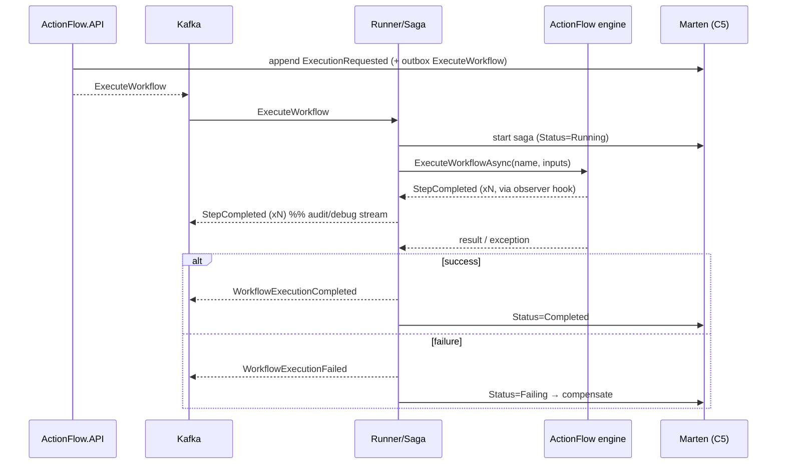

# ActionFlow Microservices Implementation Plan — Components 3, 4 & 5

Plan for building the remaining ReadMe components as a broker-based, SAGA-coordinated
microservice system on top of the existing **ActionFlow** core engine (Component 1), with
**MartenDB** as the document store.

- **Component 3 — `ActionFlow.Runner`**: worker service that hosts the ActionFlow engine, executes workflows, and owns the SAGA.
- **Component 4 — `ActionFlow.API`**: HTTP gateway for designing, executing, and debugging workflows (consumed by `actionFlow.editor`).
- **Component 5 — `ActionFlow.DB`**: Marten-backed document/event store and the `IWorkflowProvider` implementation.

---

## 1. Decisions & assumptions

These are the opinionated choices this plan is built on. They can be revisited, but the rest of the plan assumes them.

| # | Decision | Rationale | Alternative |
|---|----------|-----------|-------------|
| D1 | **Stack = Marten + Wolverine ("Critter Stack")** | Marten gives the document store (C5) *and* an event store + saga persistence on one PostgreSQL. Wolverine gives messaging, native sagas, and a **Marten transactional inbox/outbox**, so publishing to the broker is atomic with DB writes (no dual-write problem). This is the idiomatic .NET way to get "Marten + broker + SAGA". | MassTransit (mature saga state machines + Kafka rider + Marten saga repo). Pick this if the team already knows MassTransit. |
| D2 | **Broker = Kafka** (as the ReadMe states) | Durable, partitioned log; great for the execution/audit event stream and integration events. Partition by `ExecutionId` for per-execution ordering. | RabbitMQ / Azure Service Bus are a better fit for *command* traffic and saga timeouts (real queues, native delay/DLQ). A common hybrid is Kafka for events + a queue for commands. Wolverine supports Kafka directly, so we start Kafka-only and revisit if saga timeout/retry ergonomics hurt. |
| D3 | **SAGA style = Orchestration** (a Wolverine `Saga` in the Runner) | Workflow execution has a clear lifecycle needing centralized compensation, timeouts, and retries; the saga document doubles as the execution's source of truth for the **debugging** endpoint. | Choreography (services react to events, no coordinator) — looser coupling but scatters execution/compensation logic and hurts debuggability. |
| D4 | **DB-per-service via event-carried state transfer** (no shared DB) | The Runner keeps a *local* Marten-backed cache of workflow definitions, updated from `WorkflowPublished` events. Keeps the hot execution path off a network hop and honors the microservice "own your data" principle. | Shared workflow DB read directly by a cached `DocumentStoreWorkflowProvider` — simpler, acceptable early, but couples services at the database. |
| D5 | **`ActionFlow.DB` ships as a library + its own PostgreSQL/Marten schema**, not a standalone data-access service | Marten is in-process; wrapping it behind its own RPC service adds latency for no benefit. Each service that persists gets its own Marten schema. | A dedicated "Workflow Store" service (option b) if strict DB isolation is later required. |

**Assumption:** the existing `ActionFlow` engine (Component 1) stays a class library and is referenced (project/NuGet) by the Runner. A few small, backward-compatible core additions are required — see §8.

---

## 2. Target topology

```
                         ┌───────────────────────┐
   actionFlow.editor ───▶│   ActionFlow.API (C4) │  design / execute / debug (REST + OpenAPI)
        (Next.js)        │  ASP.NET Core minimal │
                         └───────┬───────────────┘
                                 │  writes workflow docs (Marten)
                                 │  publishes commands + events (Wolverine → Kafka, via outbox)
                                 ▼
          ┌───────────────────────── Kafka broker ─────────────────────────┐
          │  actionflow.commands.execute   (partition key = ExecutionId)    │
          │  actionflow.events.execution   (StepCompleted, Completed, ...)  │
          │  actionflow.events.workflow    (WorkflowPublished, ...)         │
          │  *.dlq                                                          │
          └───────┬─────────────────────────────────────────┬─────────────┘
                  │ consumes ExecuteWorkflow                  │ consumes WorkflowPublished
                  ▼                                           ▼
        ┌───────────────────────────┐            (API projections build read models
        │   ActionFlow.Runner (C3)  │             from the execution event stream for
        │  • Wolverine Saga         │             the debugging endpoints)
        │  • ActionFlow engine host │
        │  • IWorkflowProvider      │◀── local workflow cache (Marten, from events, D4)
        │  • IActionRegistry        │
        └───────────┬───────────────┘
                    │ Marten (own schema): saga state, execution event streams, outbox
                    ▼
        ┌───────────────────────────┐
        │  ActionFlow.DB (C5)        │  Marten document + event store on PostgreSQL
        │  DocumentStoreWorkflow-    │  (workflows, versions, execution streams,
        │  Provider : IWorkflowProv. │   saga docs, projections)
        └───────────────────────────┘
```

### Solution / project layout

```
ActionFlow.sln
  src/
    ActionFlow/               # C1 — existing core engine (unchanged public behavior + §8 additions)
    ActionFlow.Contracts/     # shared message DTOs (commands + events), versioned
    ActionFlow.DB/            # C5 — Marten config, documents, DocumentStoreWorkflowProvider, projections
    ActionFlow.Runner/        # C3 — worker: engine host, Wolverine saga, action registry, provider cache
    ActionFlow.Api/           # C4 — ASP.NET Core minimal API
  tests/
    ActionFlow.DB.Tests/          # Marten integration (Testcontainers: postgres)
    ActionFlow.Runner.Tests/      # saga tests (Wolverine test harness) + engine host tests
    ActionFlow.Api.Tests/         # WebApplicationFactory + contract tests
    ActionFlow.Integration.Tests/ # full path: postgres + kafka via Testcontainers
  deploy/
    docker-compose.yml        # postgres, kafka, kafka-ui, jaeger
    k8s/                      # (later) helm chart / manifests
  actionFlow.editor/          # C2 — existing
```

---

## 3. Component 5 — `ActionFlow.DB` (build first)

The persistence foundation everything else depends on.

**Responsibilities**
- Marten `DocumentStore` configuration (schema, JSON serialization, indexes).
- Document types:
  - `WorkflowDocument` — `{ Id (name+version), Name, Version, IsLatest, Steps, OutputParameters, Metadata, CreatedAt }`. Maps to/from the core `Workflow`.
  - Execution read models (see projections below).
- **`DocumentStoreWorkflowProvider : IWorkflowProvider`** — the default provider for the Runner (fulfills the ReadMe's C5 goal).
- Event store streams for executions (`ExecutionRequested`, `StepCompleted`, `StepFailed`, `WorkflowCompleted`, …) — the raw material for the debugging timeline.
- Marten async projections → `WorkflowExecutionStatus` read model.
- Hosts the Wolverine saga store and inbox/outbox tables (same Marten/Postgres).

**Core interface friction (must resolve — see §8):** `IWorkflowProvider` today is `List<Workflow> GetAllWorkflows()` (synchronous, load-everything). For a DB-backed, versioned, potentially large store we need async, by-name, by-version access. Plan: add `Task<Workflow?> GetWorkflowAsync(string name, CancellationToken)` (+ optional version) to the core interface while keeping `GetAllWorkflows()` for compatibility. `DocumentStoreWorkflowProvider` implements both; `GetAllWorkflows()` is cache-backed.

**Testing:** Testcontainers PostgreSQL; round-trip `WorkflowDocument`, provider by-name/latest-version, projection rebuild.

---

## 4. Component 3 — `ActionFlow.Runner`

Worker service (`Microsoft.Extensions.Hosting`) that hosts the engine and the saga.

**Hosting abstractions (per ReadMe)**
- `IWorkflowProvider` — default = the local cached provider (D4) backed by `ActionFlow.DB`; pluggable.
- `IActionRegistry` — wraps the core `IStepActionFactory`; registers the default actions (`AddDefaultActions`) and supports custom action registration (assembly scan / plugin folder). This is the ReadMe's "ActionRegistry — a way for registering actions (with or without the default ones)".
- Composition: instead of `services.UseActionFlowEngine()` with `BlankWorkflowProvider`, the Runner wires `UseActionFlowEngine()` and then overrides the provider with the Marten-backed one and populates the factory via `IActionRegistry`.

**Execution handler**
- Consumes `ExecuteWorkflow` command → resolves the workflow from the provider cache → maps request inputs to `Parameter[]` → calls `IActionFlowEngine.ExecuteWorkflowAsync(name, inputs)`.
- Emits a `StepCompleted`/`StepFailed` event per step (requires the step observer hook, §8) for the debugging timeline and fine-grained compensation.
- On success → `WorkflowExecutionCompleted { ExecutionId, OutputParameters }`; on exception → `WorkflowExecutionFailed { ExecutionId, Error, LastCompletedStepIndex }`.
- All event publishing goes through the **Marten/Wolverine outbox** so it is atomic with saga-state writes.

**Workflow cache invalidation:** consumes `WorkflowPublished` (from the API) and upserts the local workflow cache; the engine's in-memory dictionary is refreshed/evicted on publish.

---

## 5. Component 4 — `ActionFlow.API`

ASP.NET Core minimal API (.NET 10), OpenAPI-documented; the editor's backend.

**Endpoints**
- **Design (CRUD):** `GET/POST/PUT/DELETE /workflows`, `GET /workflows/{name}/versions`. Writes `WorkflowDocument` (Marten) and publishes `WorkflowPublished` (transactional outbox) so Runners refresh caches.
- **Validate/compile:** `POST /workflows/{name}/validate` — surfaces Component 1's compilation/optimization to catch bad expressions/steps before execution.
- **Execute:** `POST /workflows/{name}/execute` → within one Marten session: append `ExecutionRequested` to a new execution stream **and** publish `ExecuteWorkflow` via the outbox → return `202 Accepted` + `ExecutionId`.
- **Debug/query:** `GET /executions/{id}` (status read model), `GET /executions/{id}/events` (event-stream timeline), `GET /executions?status=&workflow=`.

**Cross-cutting:** authN/Z, request validation, rate limiting, problem-details errors, CORS for the editor.

---

## 6. Messaging contracts (`ActionFlow.Contracts`)

Shared, versioned DTOs. Kafka topic mapping done in Wolverine config.

**Commands** (point-to-point)
- `ExecuteWorkflow { ExecutionId, WorkflowName, Version?, Inputs: Dictionary<string,string>, CorrelationId }`
- `CompensateWorkflow { ExecutionId, ThroughStepIndex }`

**Events** (pub/sub, integration + audit)
- `WorkflowPublished { Name, Version, ... }`
- `WorkflowExecutionRequested { ExecutionId, WorkflowName, RequestedAt }`
- `WorkflowExecutionStarted { ExecutionId }`
- `StepCompleted { ExecutionId, StepName, Index, DurationMs }`
- `StepFailed { ExecutionId, StepName, Index, Error }`
- `WorkflowExecutionCompleted { ExecutionId, OutputParameters }`
- `WorkflowExecutionFailed { ExecutionId, Error, LastCompletedStepIndex }`
- `WorkflowExecutionCompensated { ExecutionId }`

**Conventions:** every message carries `ExecutionId` (correlation + Kafka partition key). Idempotency via Wolverine/Marten inbox message dedupe. Message versioning by additive fields / `V2` types + upcasters.

---

## 7. The SAGA (orchestration)

State stored as a Marten document, coordinated by a Wolverine `Saga` living in the Runner.

**Saga state:** `WorkflowExecutionSaga { Id = ExecutionId, WorkflowName, Status, CurrentStepIndex, CompletedSteps[], StartedAt, Error }` where `Status ∈ {Requested, Running, Completed, Failing, Compensating, Compensated, Failed}`.

**Happy path**



**Compensation (baseline, coarse-grained):** on `WorkflowExecutionFailed`, if any completed steps are *compensatable*, the saga transitions to `Compensating` and issues `CompensateWorkflow` (or per-step compensation commands) in **reverse order** of `CompletedSteps`, then → `Compensated`. Steps with no compensation are logged and skipped.

**Reliability:**
- **Timeouts** — saga schedules a deadline on `Running`; if no terminal event arrives, mark `Failed` and (optionally) compensate. (Kafka has no native delay → use Wolverine scheduled messages / a timer; this is the main reason D2 flags a queue broker as a possible complement.)
- **Retries** — transient handler failures retried with backoff; poison messages → DLQ topic.
- **Idempotency** — inbox dedupe + saga state guards make redelivery safe.

**Evolution — fine-grained per-action saga (Phase 5):** treat each side-effecting workflow *action* as a saga activity with its own compensation. Requires an `ICompensableAction { Task Compensate(...) }` in core (§8) and moves ActionFlow toward a true distributed saga orchestrator. Introduce only once the coarse-grained flow is solid, and only for actions that declare compensation.

---

## 8. Required changes to Component 1 (`ActionFlow` core)

Small, backward-compatible additions that unblock the services:

1. **Async/by-name provider** — extend `IWorkflowProvider` with `Task<Workflow?> GetWorkflowAsync(string name, CancellationToken)` (keep `GetAllWorkflows()`). Lets `DocumentStoreWorkflowProvider` avoid loading everything and support versioning. (`ActionFlowEngine.GetWorkflow` currently caches all workflows in a `Dictionary` — adapt to lazy/async load + event-driven eviction.)
2. **Step lifecycle observer** — an `IStepExecutionObserver` (or event) invoked by `StepExecutionEvaluator.EvaluateAndRunStep` before/after each step. The Runner subscribes to emit `StepCompleted`/`StepFailed` and to drive fine-grained compensation. No-op default preserves current behavior.
3. **(Phase 5) `ICompensableAction`** — optional interface an action can implement to declare a compensating operation; the saga replays these in reverse on failure.
4. **Serializable execution context** — ensure inputs/outputs (`Parameter`, `ActionFlowEngineResult.OutputParameters`) round-trip cleanly through message/JSON boundaries (they already are simple string/dictionary shapes — verify with contract tests).

Each ships behind defaults so the existing library and its tests keep passing.

---

## 9. Phased delivery

| Phase | Deliverable | Exit criteria |
|-------|-------------|---------------|
| **0 — Foundations** | Solution restructure (`src/`, `tests/`, `deploy/`), `ActionFlow.Contracts`, `docker-compose` (postgres, kafka, kafka-ui, jaeger), Marten + Wolverine bootstrap. | `docker compose up` gives a working local broker + DB; empty services start and connect. |
| **1 — Component 5** | Marten store, `WorkflowDocument`, `DocumentStoreWorkflowProvider`, core interface async addition (§8.1). | Provider loads workflows by name/version from Postgres; Testcontainers integration tests green. |
| **2 — Component 3 (exec)** | Runner hosts engine, `IActionRegistry`, consumes `ExecuteWorkflow`, runs, emits events via outbox; step observer hook (§8.2). | End-to-end (no saga): publish `ExecuteWorkflow` → engine runs → `WorkflowExecutionCompleted` observed on Kafka. |
| **3 — SAGA** | Wolverine `WorkflowExecutionSaga`: lifecycle, timeouts, retries, DLQ, coarse-grained compensation. | Saga tests (Wolverine harness) cover success, failure→compensate, timeout, duplicate delivery. |
| **4 — Component 4** | `ActionFlow.API`: design CRUD, validate, execute (202), status/timeline projections; wire `actionFlow.editor`. | Editor can create a workflow, trigger execution, and watch status/timeline. |
| **5 — Advanced** | Fine-grained `ICompensableAction` compensation; surface compile/optimize endpoint. | Failing multi-step workflow with side effects rolls back per-action. |
| **6 — Ops** | OpenTelemetry (traces correlated by `ExecutionId` across the broker), health checks, containerization, k8s/helm, CI pipelines. | Traces span API→Kafka→Runner→DB; images build in CI; deployable manifests. |

---

## 10. Cross-cutting concerns

- **No dual-write:** *all* "write DB + publish message" happens in one Marten session via the Wolverine outbox. This is the single most important correctness rule.
- **Ordering:** Kafka partition key = `ExecutionId` guarantees per-execution ordering; different executions parallelize across partitions.
- **Observability:** OpenTelemetry tracing/metrics (Wolverine + Marten instrumented), structured logs keyed by `ExecutionId`/`CorrelationId`, Jaeger locally.
- **Security:** API authN/Z (JWT), broker ACLs/mTLS, no secrets in code (config/secret store).
- **Versioning:** workflow definitions versioned in Marten; message contracts versioned additively with upcasters.
- **Testing:** unit (handlers, provider) → saga harness tests → Testcontainers integration (postgres+kafka) → contract tests between API and Runner.
- **Local dev:** `deploy/docker-compose.yml` for the full stack; services run via `dotnet run` against it.

## 11. Key risks

- **Kafka for saga commands/timeouts** (D2) — no native delay/queue semantics; if timeout/retry ergonomics get painful, add RabbitMQ/ASB for command traffic and keep Kafka for events.
- **Provider interface churn** (§8.1) — touches the engine's workflow cache; keep changes additive and cover with the existing MSTest suite.
- **Compensation semantics** — fine-grained rollback (Phase 5) is only meaningful for actions that can define a compensation; document which built-in actions are compensatable (e.g., `SendHttpCall` typically is *not* idempotent/compensatable without app-specific logic).
- **Cache coherence** (D4) — event-carried workflow cache must handle out-of-order/missed `WorkflowPublished` events (use versioned upserts + periodic reconciliation).

---

## 12. Recommended first step

Phase 0 + Phase 1: stand up `deploy/docker-compose.yml`, restructure into `src/`, add `ActionFlow.DB` with Marten and `DocumentStoreWorkflowProvider`, and make the `IWorkflowProvider` async addition (§8.1) with Testcontainers tests. That yields a persistent, versioned workflow store — the foundation both other services build on — without yet committing to broker/saga details.
